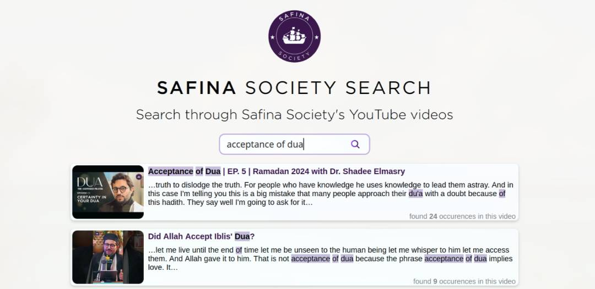

#  [Safina Society Search](https://safinasocietysearch.com/)
  

## Motivation?

The Safina Society YouTube channel has a wealth of knowledge about Islam covering many different topics with over 1800 videos. YouTube's search function is not sufficient when you are looking to search if a certain question was discussed in a video or if you are trying to recall which video something was mentioned in.

Safina Society Search solves the problem by allowing you to also search through the transcripts of every Safina Society YouTube video. Additionally, the search engine also provides timestamped links to videos where a term/phrase is mentioned.

## Setup for development

Software Stack used: [Golang](https://go.dev/) + [Templ](https://templ.guide/) + [HTMX](https://htmx.org/) with self-hosted instance of [Meilisearch](https://www.meilisearch.com/) for the search engine.

1. Clone this repo
2. Install dependencies `cd safina-society-search && go get .`
3. Create .env file (refer to .env.example)
4. Setup a local instance of Meilisearch ([Further instructions here](docs/meilisearch.md))
5. Add the meilisearch url to .env file
6. start the server `go run .`

## Contributing

Contributions are welcome. Fork the repo and open a pull request. Reach out [hello@safinasocietysearch.com](mailto:hello@safinasocietysearch.com) for any clarifications.

Note: This repo does not provide access to the production Meilisearch instance. Please do any testing against your own local Meilisearch instance. If you still require access to the production instance to test a new feature/fix you are working on, reach out to me through the above email address.
